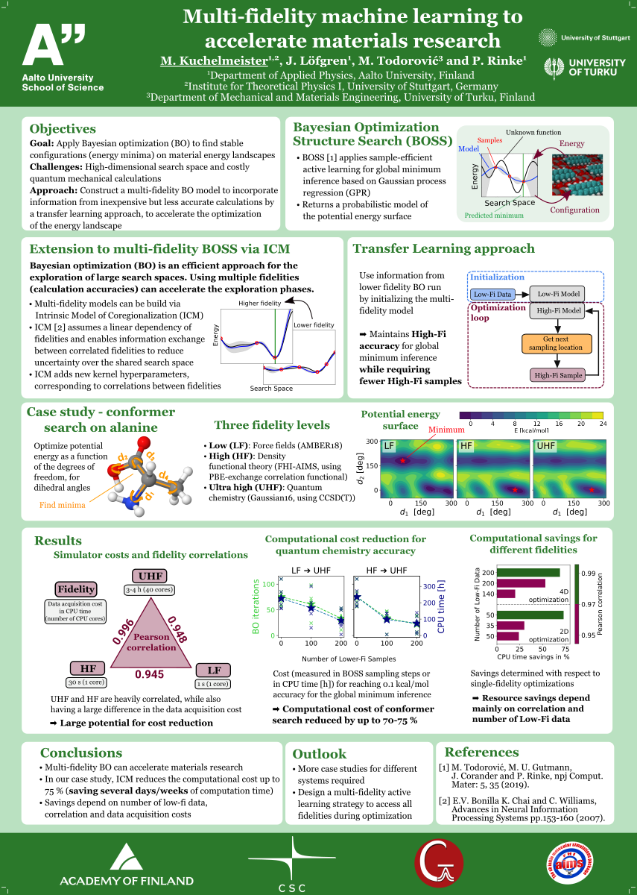

# Multi-fidelity machine learning to accelerate materials research
## About this project

This repository contains research that I have presented on
the [Physics Days 2022](https://physicsdays2022.aalto.fi/). The main objective was to investigate the effectiveness of **Transfer/Mult-task Learning on Bayesian
Optimization**, please read the abstract below for a more
detailed introduction.

Structure of the repository:
- `data` Contains raw data files, used to produce the figures.
- `docs` : Abstract and poster for the Physics Days 2022 can be found here.
- `results` : Figures and Tables used for the documents.
- `scripts/src` : Python scripts and Jupyter Notebooks to preprocess and plot data.
---
---
## Authors
**M. Kuchelmeister**¹,², J. Lögfren¹, M. Todorović³, and P. Rinke¹

¹*Department of Applied Physics, Aalto University*

²*Institute for Theoretical Physics I, University of Stuttgart*

³*Department of Mechanical and Materials Engineering, University of Turku*

email: <manuel.kuchelmeister@web.de>

---
## Abstract
The computational optimization and exploration of materials is a challenging task,
due to the high dimensionality of the search space and the high cost of accurate
quantum mechanical calculations. To reduce the number of costly calculations,
the Bayesian Optimization Structure Search [BOSS](https://gitlab.com/cest-group/boss)
has been developed. BOSS combines sample-efficient active learning with
Gaussian process regression.

We here present a multi-fidelity approach (Figure a)) that
can reduce the number of costly, accurate calculations even further by
incorporating information from inexpensive but less accurate calculations.
We implemented the [intrinsic model of coregionalization](https://proceedings.neurips.cc/paper/2007/file/66368270ffd51418ec58bd793f2d9b1b-Paper.pdf) method
into BOSS to sample data from multiple atomistic calculations
based on quantum chemistry (Gaussian 16, using CCSD(T)), density-functional theory
(FHI-aims, using a PBE exchange-correlation functional) and force fields (AMBER18).
Multi-fidelity BOSS is initialized with lower-fidelity data
and continues to sample only higher-fidelity calculations, maintaining CCSD(T)
accuracy for the global minimum inference.

We tested our multi-fidelity model on 4D alanine conformer search
(Figure b)).
The efficiency of our approach is measured by computational
cost in CPU hours, comparing runs with and without lower-fidelity (LF) data
((Figure c)). We were able to reduce the computational
cost for a CCSD(T) run, when using DFT as LF data, by about 70\%.
We found that the efficiency of the ICM model depends on both the correlation
and computational cost difference between the fidelities, as well as the
number of LF data. Our test serves as a first benchmark for the great
potential that multi-fidelity learning can have to reduce expensive
structure-search problems.

---
## Results
The on the Physics Days 2022 presented poster can be found [here](https://raw.githubusercontent.com/mankuch/physics-days-2022/master/results/poster.png?token=GHSAT0AAAAAABMEMTMFPRPSMAKLZNSNCI2GYRINGDA), here is a rescaled preview:

    

---
## References
[M. Todorović, M.U.Gutmann, J.Corander, and P.Rinke, *npj Comput. Mater*. **5**, 35 (2019).](https://www.nature.com/articles/s41524-019-0175-2)

[E.V. Bonilla, K.M.A. Chai, C.K.I. Williams, *Advances in Neural Information Processing Systems* pp.153-160 (2007).](https://proceedings.neurips.cc/paper/2007/file/66368270ffd51418ec58bd793f2d9b1b-Paper.pdf)
